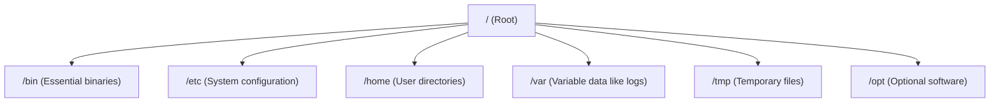

# Module 01: Linux and Shell

Linux is the foundational OS for most of modern infrastructure and DevOps tooling. Comfort with the shell is a non-negotiable skill.

## 🗂️ Filesystem Hierarchy

Linux systems follow a standard directory structure:

## 🔒 File Permissions

Linux uses a permissions model based on Owners, Groups, and Others.
Read (r=4), Write (w=2), Execute (x=1).

- `chmod 755 script.sh`: Grants rwx (4+2+1=7) to owner, rx (4+1=5) to group and others.
- `chown user:group file`: Changes the owner and group of a file.

## 🔄 Processes

A process is a running instance of a program.
- `ps`: Snapshot of current processes.
- `top` / `htop`: Interactive real-time process viewer.
- `kill <PID>`: Send a signal to a process (default is SIGTERM, graceful shutdown). `kill -9` forces termination (SIGKILL).

## 📦 Package Managers

Used to install, update, and manage software.
- Debian/Ubuntu: `apt` (e.g., `apt update`, `apt install curl`)
- macOS: `brew` (Homebrew)
- RHEL/CentOS: `yum` or `dnf`

## 🔀 Piping and Redirection

- `>` : Redirect standard output to a file, overwriting it.
- `>>` : Redirect standard output, appending to the file.
- `|` : Pipe standard output of one command into standard input of another.
  Example: `ps aux | grep nginx`

## 🌍 Environment Variables

Key-value pairs available to the shell and child processes.
- View them: `printenv` or `env`
- Set them: `export API_KEY="12345"`
- Access them: `echo $API_KEY`

---
**Next Module:** [Module 02: Networking Basics](../02-networking-basics)

**Further Reading:**
- [Linux Filesystem Hierarchy Standard](https://refspecs.linuxfoundation.org/FHS_3.0/fhs/index.html)
- [Bash Scripting Tutorial](https://linuxconfig.org/bash-scripting-tutorial-for-beginners)
