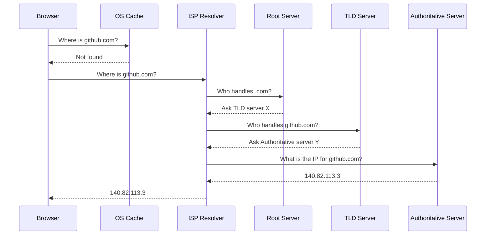

# Module 02: Networking Basics

Networking is how services talk to each other. You don't need to be a network engineer, but you must understand DNS, ports, and firewalls to debug distributed systems.

## 🍰 The OSI Model (Practical Framing)

We mainly care about these layers:
- **Layer 3 (Network):** IP Addresses (e.g., `192.168.1.5`). Routing packets across networks.
- **Layer 4 (Transport):** TCP (reliable, ordered) vs UDP (fast, fire-and-forget). Ports live here.
- **Layer 7 (Application):** HTTP, DNS, SSH, Postgres protocols.

## 🗺️ DNS Resolution Flow

DNS is the phonebook of the internet.

## 🚪 Common Ports

| Port | Protocol | Use Case |
|------|----------|----------|
| 22 | TCP | SSH (Secure Shell) |
| 80 | TCP | HTTP (Unencrypted web traffic) |
| 443 | TCP | HTTPS (Encrypted web traffic) |
| 3306 | TCP | MySQL Database |
| 5432 | TCP | PostgreSQL Database |
| 6379 | TCP | Redis Cache |

## 🧱 Firewalls

A firewall controls what traffic is allowed in (ingress) or out (egress) based on rules (IP, Port, Protocol). If a service is running but you can't reach it, check the firewall.

## 🔑 SSH Key-Based Auth

SSH allows secure remote login. Instead of passwords, we use a public/private key pair.
- **Private Key (`id_rsa` / `id_ed25519`):** Stays on your machine. NEVER share this.
- **Public Key (`id_rsa.pub` / `id_ed25519.pub`):** Goes on the server (e.g., inside `~/.ssh/authorized_keys`).

---
**Next Module:** [Module 03: Git and GitHub](../03-git-and-github)

**Further Reading:**
- [How DNS Works (Cloudflare)](https://www.cloudflare.com/learning/dns/what-is-dns/)
- [TCP vs UDP](https://www.cyberciti.biz/faq/key-differences-between-tcp-and-udp-protocols/)
