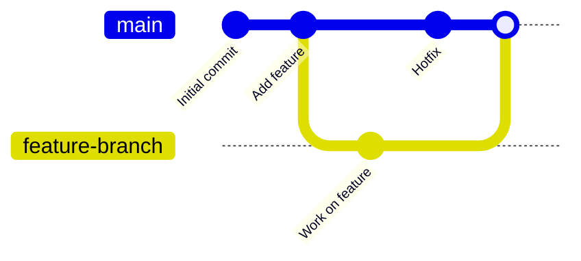

# Module 03: Git and GitHub

Version control is the bedrock of DevOps. Everything (code, infrastructure, configuration) is stored in Git.

## 🧠 Git Internals Primer

Git doesn't store file diffs; it stores snapshots of your filesystem.
Branches are just lightweight pointers to a specific commit.

## 🌳 Branching Strategies

| Strategy | Description | Best For |
|----------|-------------|----------|
| **Trunk-based** | Everyone merges into `main` frequently (multiple times a day). Short-lived feature branches. | High-performing DevOps teams, CI/CD. |
| **GitFlow** | Strict branches (`main`, `develop`, `release`, `feature`). Slower release cycles. | Legacy software, strict QA gates. |

## 🔀 Merging vs Rebasing

When integrating changes from a feature branch into main:

- **Merge (`git merge`)**: Creates a new "merge commit". Preserves the exact history but can lead to a messy, intertwined commit log.
- **Rebase (`git rebase`)**: Moves the base of your feature branch to the tip of main. Rewrites history for a clean, linear commit log. *Never rebase commits that have already been pushed to a shared remote.*

## 🤝 The Pull Request (PR) Workflow

1. Create a branch: `git checkout -b feature-x`
2. Make commits: `git add . && git commit -m "docs: update readme"`
3. Push branch: `git push -u origin feature-x`
4. Open a PR on GitHub.
5. Code Review & CI checks pass.
6. Merge PR (often using "Squash and Merge" for a clean history).

## 🛡️ Branch Protection Rules

In GitHub, you can protect `main` by enforcing:
- Require pull request reviews before merging.
- Require status checks to pass (e.g., CI tests).
- Prevent direct pushes to `main`.

---
**Next Module:** [Module 04: CI/CD Fundamentals](../04-cicd-fundamentals)

**Further Reading:**
- [Atlassian: Merging vs Rebasing](https://www.atlassian.com/git/tutorials/merging-vs-rebasing)
- [GitHub Flow](https://docs.github.com/en/get-started/quickstart/github-flow)
