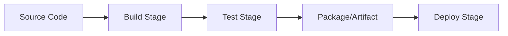

# Module 04: CI/CD Fundamentals

CI/CD stands for **Continuous Integration** and **Continuous Delivery** (or Deployment). It is the process of automating the building, testing, and deployment of software.

## 🏭 Pipeline Stages

A typical pipeline looks like this:


## 🔄 CI vs CD vs CD

| Term | Meaning | Trigger | End Result |
|------|---------|---------|------------|
| **Continuous Integration (CI)** | Merging code changes frequently and automatically running builds and tests. | Push / PR | Confidence that the new code doesn't break the build. |
| **Continuous Delivery (CD)** | Automating the release process so that you *can* deploy at any time with a single click. | Manual Approval | Code is staged and ready for production. |
| **Continuous Deployment (CD)** | Every change that passes automated tests is deployed to production automatically. | Fully Automated | Code is live in production. |

## 📜 YAML Syntax Primer

Most modern CI/CD tools (GitHub Actions, GitLab CI, CircleCI) use YAML for configuration.
- **Key-Value:** `name: my-pipeline`
- **Lists:**
  ```yaml
  steps:
    - build
    - test
  ```
- **Dictionaries:**
  ```yaml
  env:
    PORT: 8080
    DEBUG: true
  ```
- **Indentation:** Spaces, *never* tabs! (Usually 2 spaces).

## 🌍 The CI/CD Landscape

- **GitHub Actions:** Native to GitHub, uses YAML, vast ecosystem of community actions. (We will use this).
- **GitLab CI:** Native to GitLab, uses YAML, very powerful and integrated.
- **Jenkins:** The legacy heavyweight. Uses Groovy scripting (`Jenkinsfile`). Highly customizable but hard to maintain.
- **CircleCI:** Fast, cloud-native, uses YAML.

---
**Next Module:** [Module 05: GitHub Actions](../05-github-actions)

**Further Reading:**
- [Atlassian: What is CI/CD?](https://www.atlassian.com/continuous-delivery/principles/continuous-integration-vs-delivery-vs-deployment)
- [Learn YAML in Y minutes](https://learnxinyminutes.com/docs/yaml/)
