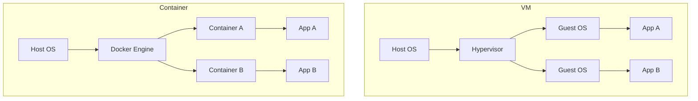

# Module 06: Docker

Docker solves the "it works on my machine" problem by packaging an application and its dependencies into a standardized unit called a container.

## 🐳 Containers vs VMs

Containers share the Host OS kernel, making them much lighter and faster to start than VMs.

## 📄 Dockerfile Instructions

A Dockerfile is the recipe for building a container image.
- `FROM`: Base image (e.g., `python:3.10-slim`). Always use specific tags, not `latest`.
- `COPY`: Copy files from host to the container.
- `RUN`: Execute commands during the build phase (e.g., `pip install`).
- `CMD`: Default command to run when the container *starts*.
- `EXPOSE`: Documentation that the container listens on a specific port.

## 🧅 Layers and Caching

Every `RUN`, `COPY`, and `ADD` instruction creates a new layer. Docker caches layers. Order matters! Put commands that change frequently (like `COPY . .`) at the bottom, and stable commands (like `pip install`) at the top.

## 🎭 Multi-stage Builds

You can use multiple `FROM` statements. This is crucial for compiled languages (Go, Java) or frontends (React) to separate the heavy build tools from the lightweight runtime image.

## 🐙 Docker Compose

A tool for defining and running multi-container Docker applications using a `docker-compose.yml` file. Great for local development (e.g., running your app + a local Postgres DB).

---
**Next Module:** [Module 07: Container Registries](../07-container-registries)

**Further Reading:**
- [Docker Documentation](https://docs.docker.com/)
- [Best practices for writing Dockerfiles](https://docs.docker.com/develop/develop-images/dockerfile_best-practices/)
