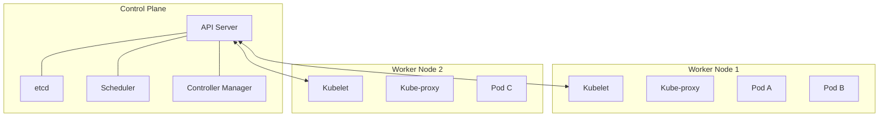

# Module 08: Kubernetes

Kubernetes (K8s) is a container orchestration platform. Docker runs a single container; Kubernetes manages thousands of them across a fleet of servers, handling scaling, self-healing, and networking automatically.

## 🏛️ Architecture

## 📦 Core Objects

| Object | Purpose |
|--------|---------|
| **Pod** | Smallest deployable unit. Usually contains 1 container. Ephemeral (they die and are replaced). |
| **ReplicaSet** | Ensures a specific number of Pod replicas are running at all times. |
| **Deployment** | Manages ReplicaSets. Handles rolling updates and rollbacks safely. |
| **Service** | Provides a stable IP address and DNS name to a set of ephemeral Pods. |
| **ConfigMap / Secret** | Stores configuration and sensitive data separate from the container image. |
| **Namespace** | Virtual clusters within the same physical cluster (e.g., `dev`, `prod`). |

## 🔌 Service Types

- **ClusterIP:** (Default) Internal IP only. Used for service-to-service communication.
- **NodePort:** Exposes the service on a static port (30000-32767) on every node's IP.
- **LoadBalancer:** Provisions a cloud load balancer (AWS ALB, GCP Cloud Load Balancer) to route external traffic into the cluster.

## 🌐 Ingress

An API object that manages external access to the services in a cluster, typically HTTP/HTTPS. It acts as a smart router, allowing you to route `api.example.com` to Service A and `example.com` to Service B using a single LoadBalancer.

---
**Next Module:** [Module 09: Helm](../09-helm)

**Further Reading:**
- [Kubernetes Components](https://kubernetes.io/docs/concepts/overview/components/)
- [Understanding Kubernetes Objects](https://kubernetes.io/docs/concepts/overview/working-with-objects/kubernetes-objects/)
