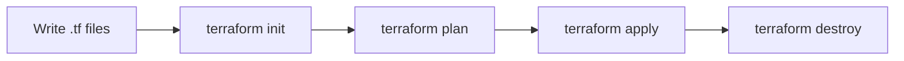

# Module 10: Terraform

Terraform is an Infrastructure as Code (IaC) tool. Instead of clicking through a cloud console to create servers and databases, you write declarative code to describe the infrastructure you want.

## 🏗️ Declarative vs Imperative

- **Imperative (Bash/Python script):** "Create server A. Then create database B. Then link them." (Focuses on the *how*).
- **Declarative (Terraform):** "I want a server and a database linked together. Make it happen." (Focuses on the *what*).

## 🔄 The Core Workflow

- `init`: Downloads provider plugins (e.g., AWS, Azure).
- `plan`: Shows you what Terraform *will* do without actually doing it. Always review this!
- `apply`: Executes the plan and provisions the real infrastructure.
- `destroy`: Tears everything down.

## 🗃️ The State File (`terraform.tfstate`)

Terraform needs to remember what it built so it can manage it later. It stores this map of the real world in a JSON file called the **State**.

**🚨 DANGER:** The state file contains sensitive data (passwords, IP addresses). NEVER commit `terraform.tfstate` to Git!

## ☁️ Remote State and Locking

In a team, you can't have the state file on your laptop. You store it in a remote backend (like an AWS S3 bucket).
To prevent two people from running `terraform apply` at the exact same time and corrupting the state, we use **State Locking** (often via a DynamoDB table).

## 📦 Modules

Modules are reusable Terraform packages. If you figure out the perfect way to build an S3 bucket with all the right security settings, you can package it as a module and reuse it across multiple projects.

---
**Next Module:** [Module 11: Cloud Basics](../11-cloud-basics)

**Further Reading:**
- [Terraform Documentation](https://developer.hashicorp.com/terraform/intro)
- [Managing Terraform State](https://developer.hashicorp.com/terraform/language/state)
